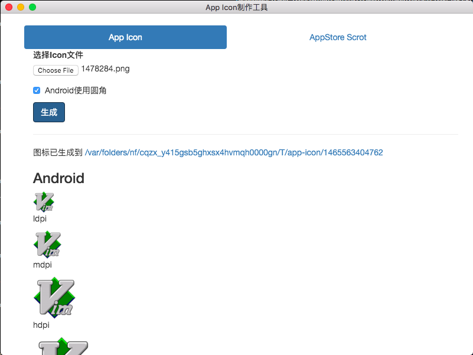
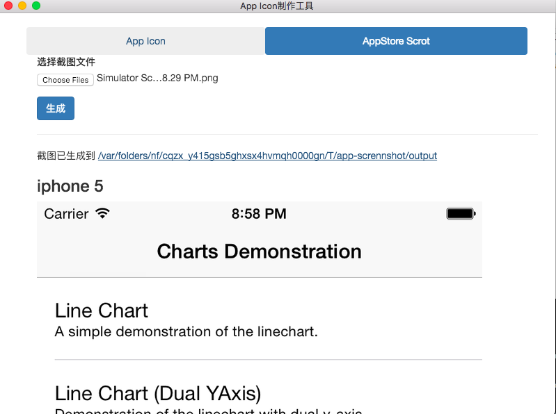

# app-icon-screenshot-generator

因为每次在 AppStore 上提交应用时都需要提交各个屏幕尺寸下的应用截图，为了一劳永逸，于是乎花了两天的时间写了个简单的程序。
可以自动生成 Android 及 iOS 下的各个尺寸的 AppIcon，以及生成各个屏幕尺寸下的应用截图。
如果需要针对 Android 应用进行截屏，可以使用 `screencap.rb` 脚本。

界面是使用 Electron 开发的，比较简陋。

